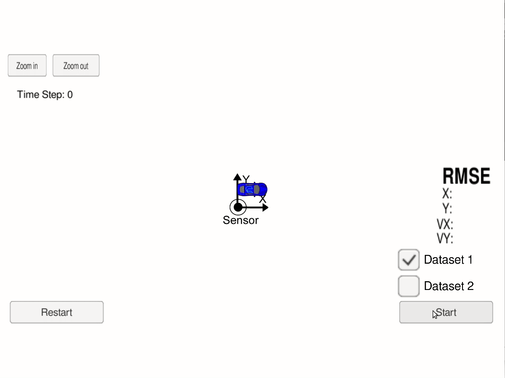
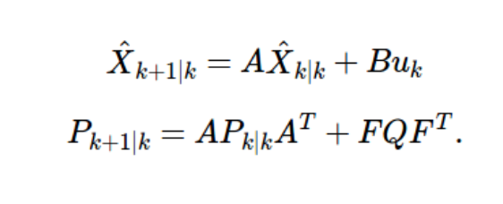
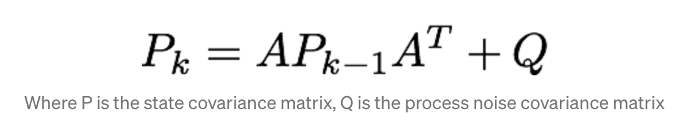
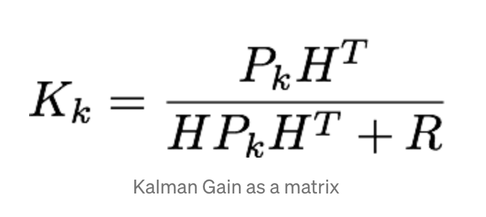
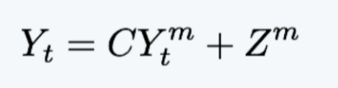
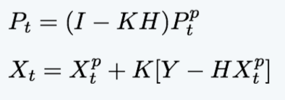
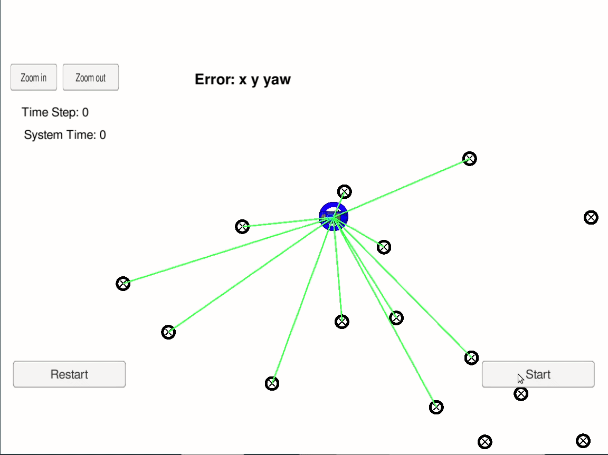

# Sensor Fusion (localization)
Two different algorithms are implemented for sensor fusion (extended Kalman filter and particle filter). Both algorithms were developed under the Udacity self-driving car engineer nano-degree.

## Overview
Kalman filters (including extended) and particle filters are algorithms used in sensor fusion. They are probabilistic models that estimate the location of a car in a given map. In this project two types of data are provided for the Kalman filter (LiDAR and RADAR), and object coordinates for the particle filter. Using these inputs, we can estimate where our vehicle (or any robot) is in a virtual world.

It should be noted that in both of these examples, we assume we have an understanding of the map that our vehicle is in. This is not always the case. In scenarios where the map is not known, we can use a SLAM algorithm that simultaneously localizes and maps the enviornment a vehicle is in. I have done a few projects involving SLAM, so feel free to check them out from my repository list.

## Dependencies Installation
Udacity provided me with some bash scripts to install all of the dependencies that you need to run both projects. If you are on a mac, then run the following command:
```bash
chmod +x install-scripts/install-mac.sh
./install-scripts/install-mac.sh
```
On linux:
```bash
chmod +x install-scripts/install-linux.sh
./install-scripts/install-linux.sh
```

## Build & Run
Both projects contains 3 scripts that you can use. The first script clean.sh deletes any old build environment. It is not compulsory but this can be useful is your system fails to build. The second script is the build.sh script. run this script to build your source code on your system. Then finally, the run.sh script can be used to test your code on a simulator provided by Udacity (click [here](https://github.com/udacity/self-driving-car-sim/releases) to install the simulator).
```bash
cd PROJECT
chmod +x clean.sh & ./clean.sh
chmod +x build.sh & ./build.sh
chmod +x run.sh & ./run.sh
```
Keep in mind that you only need to change access permissions (chmod) once. Some systems may not even require it. Also do not change the contents of CMakeList.txt (unless you know what you're doing).

## Kalman Filter

<div align="center">

</div>

When dealing with Kalman filters, almost <i>everything</i> is represented using probabilities. Therefore, if you dont have a good understanding of conditional proabilities, as well as Bayes rule then I recommend you study those conecepts before continuing. In order to localize (or estimate) the position of some agent, we use two probability density functions and a map of the world the agent is in. The first pdf is often called our measurement pdf and the second is called our estimate pdf. Essentially the measurement pdf comes from our sensors (LiDAR and/or RADAR) and our estimate pdf comes from our motion model. To explain these concepts, I will use a simple example of a car can that only go left or right on a line (this line is the map for our car).

### Initialization
We first need some kind of estimate of where our car is on this line. This initial estimate will obviosuly be inaccurate. For real self-driving cars, this estimate can be done using data from the GPS. In our example, we will assume our car has an initial state of 10m and is moving with a constant velocity of 1m/s. I used the term "state" here and this is an important term that is used very often. The state of an agent is simply a vector that define the cars position in our map. In a 3D world, our state vector for our agent will be quiet large. If we have IMU input, then our state will contain the yaw, roll and pitch values for each time step along with other information. However, for the sake of simplicity, out state vector will only contain 2 values, x (position) and v (speed). In this first time step, our state vector is a 2x1 vector containing the value 10 and 1.

### State Update (prediction)
For Extended Kalman filters, we use a more complext motion model. However, in our example, out motion model is linear. This means the velocity of our agent is constant and we dont take into account acceleration. Since at initilization, we assumed the agent is moving at 1m/s, we can estimate the position of our agent at time step 2. It will be at x = 11 (since 10 + 1 = 11). On a pdf, this will be a Gaussian distribution with u = 11 and var = var_(t-1) + var_motion. Var_motion is the variance from the motion itself. This exists because the control input (motion input) is not always 100% accurate.

<div align="center">

</div>

X is our state vector. A is our state transition matrix, and B is our motion model vector which contains two linear equations that represent how displacement and velocity changes should take place. Finallly, u is our control input vector. In our example, this will simply be a 1x1 vector containing the value 1.

<div align="center">

</div>

The P vector represents our error from prediction. Since both the measurements and control input contains small errors, we need to specify our error from prediction. The P matrix is therefore a covariance matrix of our state vectors. Since in our example, our state vector is a 2x1 vector, our covariance matrix P will simply be a 2x2 square matrix containing the variance of each state parameter. The Q matrix is the process noise covariance matrix

### Kalman Gain
Kalman gain is probably one of the most important components of Kalman filters. We have established that there exists errors in recieving control input and the state update process which we denoted with matrix P. There are also errors from reading in measurements. LiDAR and RADAR sensors will produce a certain amount of error as well. However, certain times the measurement error may be greater than the state prediction error (matrix P). Other times, the state prediction error may be less than the measurement error. Because of this uncertainty, we use the Kalman gain to decide on which calculation to rely on. Kalman gain is always between 0 and 1. If the Kalman gain is close to 0, then our state predictions are more accurate than our meassurements, and if our gain is closer to 1 then our measurements are more accurate than our predictions. Based on this value, we can update the location of our agent.



### Measurement Update
Once we have calculated the Kalman gain, we can now update our state vector. The first step is to calculate the measurment error which is denoted as y_t in the equation below. The y^(m)_(t) vector is simply a vector containing all of our measurements, while the C matrix is a matrix that transforms our measurements. Lastly, Z^m is the error vector associated with the measurements. We can now update our location estimate and our current state vector error.

<div align="center">

</div>

Updating the state vector and its estimation error is trivial. The only matrix we havent seen from the following eqautions is our H matrix. This matrix is the matrix that transforms our current state vector into the space of our measurement vector.

<div align="center">

</div>

## Particle Filters
<div align="center">

</div>


